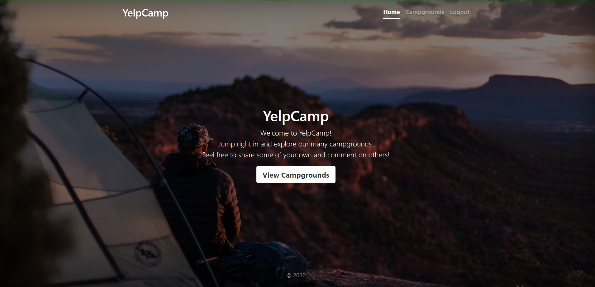
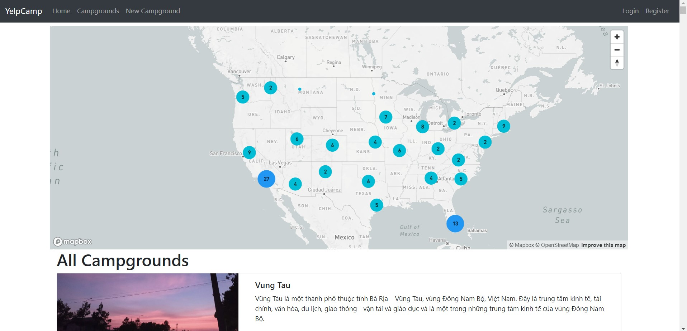
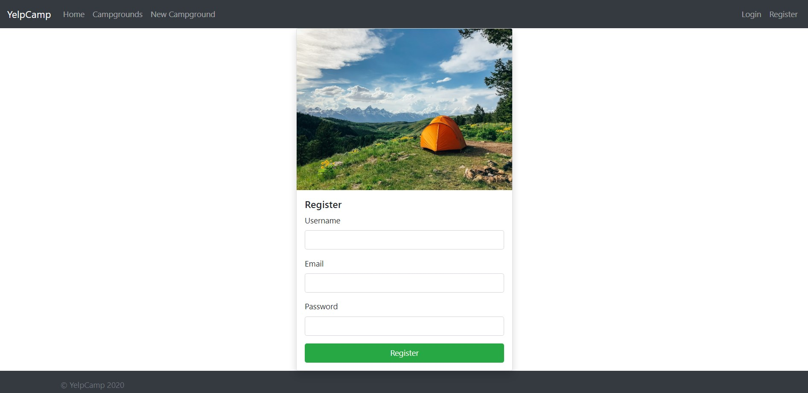
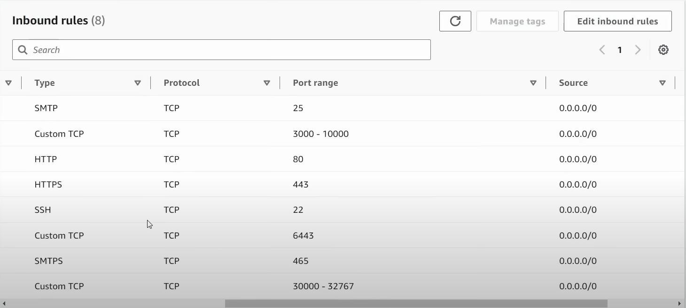

## 3-tier CICD pipeline using Jenkins for NodeJS application

	Pre-requisites
		- CLOUDINARY_CLOUD_NAME
		- CLOUDINARY_KEY
		- CLOUDINARY_SECRET
		- MAPBOX_TOKEN
		- DB_URL
		- SECRET=<Provide any Name here>
		
1. Create an Instance Name as Local, with Screenshot Open Ports
	- Install NodeJS:
	```
		sudo apt update
		curl -o- https://raw.githubusercontent.com/nvm-sh/nvm/v0.40.1/install.sh | bash
		
		"Execute the export 3 commands from the output of 1st command"

		nvm install 22
		node -v # Should print "v22.13.1"
		nvm current # Should print "v22.13.1"
		npm -v # Should print "10.9.2"
	```

2. To setup Cloudinary and Mapbox
	
	1. Create Cloudinary:
		- Go to google 
		- Search for Cloudinary.com 
		- Signup for Free 
		- Sign up with google 
		- Copy the first command and paste it in Notepad 
		- Modify that based on our requirements.
		
	This is the code you need to copy: (Example)

	```
	  import { v2 as cloudinary } from 'cloudinary';

		(async function() {

			// Configuration
			cloudinary.config({ 
				cloud_name: 'dvgmw8sgt', 
				api_key: '929683399487693', 
				api_secret: '<your_api_secret>' // Click 'View API Keys' above to copy your API secret
			});
	```
	
	2. From above code we need to modify as below:

		```
		CLOUDINARY_CLOUD_NAME=dvgmw8sgt
		CLOUDINARY_KEY=929683399487693
		CLOUDINARY_SECRET=LO8BFC1xrph1bsrN8Zzsrw3TRZw
		```
	
	
	3. Create Mapbox:
		- Go to google
		- Search for mapbox.com 
		- Click on get started for Free 
		- signup with google 
		- Give debit card details but it will not change you anything
		
		- Once Account is created, click on Access tokens and Generate the token here
		 	- Name: Local-Token
		 	- Scope: Select All
		 	- Click on Create Token and Copy the Token
		 
		- MAPBOX_TOKEN=<Paste the token here>
	
3. To Setup MongoDB:
	1. Create an MongoDB account
		- Go to Google
		- search for Mongodb atlas
		- Click on Official link
		- Create an account using Google signup
	
	
	2. Once Create Deploy your database
		- Select free M0 type
		- Name: mongo-local
		- Provider: AWS
		- Region: Mumbai
		- Create Deployment

		- Once DB Created, it provide Username and Password, Save it safe in some where
			- click on Create database user
			- click on choose a connection method
			- Click on Drives
		- Copy the URL in the Connection string into application code (3rd point)
		
		- DB_URL="<Paste the URL Here>"		# Make sure that URL is in double quotes
	
	3. Go to Network Access on the Leftside
		- Click on Add IP Address
		- Access List Entry: 0.0.0.0/0	# you need to use only from your IP address, you need to specify your local Ip address here
		- Click on confirm.
		

4. Clone the code from Github to Local:
	- GitHub URL: https://github.com/Venkat3699/3-tier-Full-Stack.git
		
5. Once Clone the code:
	1. go inside the folder:
		- cd 3-Tier-Full-Stack
		- npm install
	
	2. Create .env file and paste the pre-requisites here
	```
		vim .env
	```
	```
			CLOUDINARY_CLOUD_NAME=dvgmw8sgt
			CLOUDINARY_KEY=929683399487693
			CLOUDINARY_SECRET=LO8BFC1xrph1bsrN8Zzsrw3TRZw
			MAPBOX_TOKEN=<Paste the token here>
			DB_URL="<Paste the URL Here>"
			SECRET=<Provide any Name here>
	```		
	3. now Run the application:
		npm start
		
		"once it shows database is connected, we can access our application with PublicIP:3000 from the browser"
	
	
	

## Now Setup the App deployment using Pipelines on DEV environment

1. Create 2 instances as shown below in AWS Cloud:

	Create an Instance:
		Name: Jenkins
		OS image: Ubuntu 20.04LTS
		InstanceType: t2.large
		keyPair: select/create keyPair
		Network:
			Select the existing SG and Select our open ports SG
		
		Volume: 25
		Click on Create

	Create an Instance:
		Name: SonarQube
		OS image: Ubuntu 20.04LTS
		InstanceType: t2.medium
		keyPair: select/create keyPair
		Network:
			Select the existing SG and Select our open ports SG
		
		Volume: 15
		Click on Create

2. Install Jenkins on Jenkins Server:
	Connect to Jenkins Server using Putty/GitBash/Mobaxterm
		- Install Java & Jenkins (jenkins.sh):
		```
			sudo apt update
			sudo apt install fontconfig openjdk-17-jre
			java -version
			sudo wget -O /usr/share/keyrings/jenkins-keyring.asc \
			  https://pkg.jenkins.io/debian-stable/jenkins.io-2023.key
				
			echo "deb [signed-by=/usr/share/keyrings/jenkins-keyring.asc]" \
			  https://pkg.jenkins.io/debian-stable binary/ | sudo tee \
			  /etc/apt/sources.list.d/jenkins.list > /dev/null
			  
			sudo apt-get update
			
			sudo apt-get install jenkins -y
			
			sudo systemctl enable jenkins
			
			sudo systemctl start jenkins
			
			sudo systemctl status jenkins
		```

		- Install Docker:
		```
			sudo apt install docker.io
			sudo chmod 666 /var/run/docker.sock
		```	
		- Install Trivy (trivy.sh):
		```
			sudo apt-get install wget apt-transport-https gnupg lsb-release
			wget -qO - https://aquasecurity.github.io/trivy-repo/deb/public.key | sudo apt-key add -
			echo deb https://aquasecurity.github.io/trivy-repo/deb $(lsb_release -sc) main | sudo tee -a /etc/apt/sources.list.d/trivy.list
			sudo apt-get update
			sudo apt-get install trivy
		```
	
	Create the Admin User here
			
3. Install SonarQube on SonarQube Server:
	Connect to SonarQube Server using Putty/GitBash/Mobaxterm:
		- Install Docker:
		```
			sudo apt update
			sudo apt install docker.io
			sudo chmod 666 /var/run/docker.sock
		```

		- Install SonarQube Container:
		```
			docker run -d --name sonar -p 9000:9000 sonarqube:lts-community
			docker ps
		```
			
	Access the SonarQube application from the Browser with PublicIP:9000
	For Login:
	```
		username: admin
		password: admin
	```

	Create a SonarQube Token for the Jenkins Configuration:
		Click on Administration
		Click on Security
		Click on Users
		Generate Token Here
		Copy this token and paste it in some where 
		
4. Go to DockerHub:
	Create a Token for the Jenkins Credentials:
		Click on Profile Icon
		Click on Account Settings
		In Security:
			Click on Personal Access Token
			Generate a Token Here
			Copy this token and paste it in some where 
		
5. In Jenkins Console, we need to Install certain Plugins:
	Jenkins Console:
		Click on Manage Jenkins
		Click on Plugins
		Click on Available Plugins
		Search and Select below Plugins:
			NodeJS
			SonarQubeScanner
			Docker
			DockerPipeline
			Kubernetes
			KubernetesCLI
		Click on Install
		
6. Configure Plugins on Jenkins Server:
	Manage Jenkins:
		Tools:
			SonarQube Scanner Installation:
				Name: sonar-scanner
				Install Automatically with Latest Version  (or with your required version)
				
			NodeJs Installation:
				Name: nodejs
				Install Automatically with Latest Version (or with your required version)
				
			Docker Installation:
				Name: docker
				Install Automatically with Latest Version (or with your required version)
			Click on Apply and Save
			
		System:
			SonarQube server:
				sonarqube installation:
					Add sonarqube
						Name: sonar
						ServerURL: http://<PublicIP of sonarqube>:9000
						SonarAuthenticationToken: Select the Credentials here
						Click on Apply and Save
			
		Credentials:
			click on global
			click on Add Credentials (For SonarQube)
			select secret text:
				secret: <paste the token you copied from sonarqube>
				id: sonar-token
				description: sonar-token
			click on create
			
			Click on global
			click on Add Credentials (For Docker)
			Select Username & Password
				username: Provide your dockerhub username
				password: Provide DockerHub Token here
				id: docker-cred
				description: docker-cred
			click on create
		
7. Create a Pipeline in Jenkins Server:
	Click on New Item;
		Name: Dev-env-3tier
		select pipeline
		click on ok
		
	In General: 
		Enable Discard Old Builds
		Max of builds to Keep: 2
		
8. Create a pipeline for the Application:
	The Pipeline Name is Dev-Campground:
	```
		pipeline {
			agent any

			tools {
				nodejs 'nodejs'         // we have mentioned in tools section in manage jenkins that we are using nodejs section name
			}

			environment {
				SCANNER_HOME= tool 'sonar-scanner'      // we have mentioned in tools section in manage jenkins that we are using sonarqube scanner section name
			}

			stages {
				stage ('Clean Workspace'){
					steps {
						cleanWs()
					}
				}

				stage ('Code CheckOut'){
					steps {
						git credentialsId: 'git-cred', url: 'https://github.com/jaiswaladi246/3-Tier-Full-Stack.git'
					}
				}

				stage ('Install Dependencies'){
					steps {
					   sh "npm install"
					}
				}

				stage ('Unit Test cases'){
					steps {
						sh "npm test"
					}
				}

				stage ('Trivy FS Scan'){
					steps {
						sh "trivy fs --format table -o fs-remote.html ."
					}
				}

				stage ('SonarQube Scan'){
					steps {
						script {	
							withSonarQubeEnv('sonar') {		// we have configure credentials in the Jenkins system, for that Name is sonar
								sh " $SCANNER_HOME/bin/sonar-scanner -Dsonar.projectKey=Campground -Dsonar.projectName=Campground "
							}
						}
					}
				}

				stage ('Docker Build & Tag'){
					steps {
						script {
							withDockerRegistry(credentialsId: 'docker-cred', toolName: 'docker') {
								sh "docker build -t ravisree900/campground:${BUILD_NUMBER} ."
							}
						}
					}
				}

				stage ('Trivy Image Scan'){
					steps {
						sh " trivy image --format table -o fs-remote.html ravisree900/campground:${BUILD_NUMBER} "
					}
				}

				stage ('Docker Push'){
					steps {
						script {
							withDockerRegistry(credentialsId: 'docker-cred', toolName: 'docker') {
								sh " docker push ravisree900/campground:${BUILD_NUMBER} "
							}
						}
					}
				}

				stage ('Docker Deploy to Dev'){
					steps {
						script {
							withDockerRegistry(credentialsId: 'docker-cred', toolName: 'docker') {
								sh " docker run -d --name camp -p 3000:3000 ravisree900/campground:${BUILD_NUMBER} "
							}
						}
					}
				}
			}
		}
	```	
	Click on Apply and Save
	Click on Build Now
	
	Here We can Access the application with PUBLICIP:3000
		
		
		


##  Setup the Production Environment to Deploy Our Appication 

	Setup EKS Cluster on Jenkins Server:
		Pre-requisites:
			- One IAM User With Required Policies
			- AWSCLI Installation
			- Kubectl Installation
			- eksctl Installation
		
	- IAM USER CREATION:
		AWS Console:
			Go to IAM Page:	
				Click on Policies: 
					Click on Create policy:
							Select JSON and Paste below policy
							```
								{
									"Version": "2012-10-17",
									"Statement": [
										{
											"Sid": "VisualEditor0",
											"Effect": "Allow",
											"Action": "eks:*",
											"Resource": "*"
										}
									]
								}
							```
							Name: eksfullaccess
							
						click on create policy
			
			
				Click on Users:
					Click on Create User
						Name: eks-user
						click on Next
						select attach policies, and attach below mentioned policies:
						```
							AmazonEC2FullAccess

							AmazonEKS_CNI_Policy

							AmazonEKSClusterPolicy

							AmazonEKSWorkerNodePolicy

							AWSCloudFormationFullAccess

							IAMFullAccess
							
							eksfullaccess (above created policy)
						```
					Click on Create User	
					
				Create an Access_Key and Secret_key for the above user
			
		
	Installation Steps (eks.sh 'Mention only Commands'):

		- AWSCLI:
		```
			curl "https://awscli.amazonaws.com/awscli-exe-linux-x86_64.zip" -o "awscliv2.zip"
			sudo apt install unzip
			unzip awscliv2.zip
			sudo ./aws/install
		```
			
		- KUBECTL:
		```
			curl -o kubectl https://amazon-eks.s3.us-west-2.amazonaws.com/1.19.6/2021-01-05/bin/linux/amd64/kubectl
			chmod +x ./kubectl
			sudo mv ./kubectl /usr/local/bin
			kubectl version --short --client
		```
			
		- EKSCTL:
		```
			curl --silent --location "https://github.com/weaveworks/eksctl/releases/latest/download/eksctl_$(uname -s)_amd64.tar.gz" | tar xz -C /tmp
			sudo mv /tmp/eksctl /usr/local/bin
			eksctl version
		```
			
	We need to Configure AWS Credentials in Jenkins:
	```
		aws configure
		<Provide Access_Key>
		<Provide Secret_key>
		<Provide Region>
	```
		
			
	Setup EKS CLUSTER:
		Install EKS Cluster (based on your requirement change the Cluster Name):
		```
			eksctl create cluster --name=eksCluster \
								  --region=ap-south-1 \
								  --zones=ap-south-1a,ap-south-1b \
								  --version=1.30 \
								  --without-nodegroup
		```

		Create an IAM OIDC Provider:
		```
			eksctl utils associate-iam-oidc-provider \
				--region ap-south-1 \
				--cluster eksCluster \
				--approve
		```

		Create eksctl nodegroup:
		```
			eksctl create nodegroup --cluster=eksCluster \
								   --region=ap-south-1 \
								   --name=eksNode \
								   --node-type=t3.medium \
								   --nodes=3 \
								   --nodes-min=2 \
								   --nodes-max=4 \
								   --node-volume-size=20 \
								   --ssh-access \
								   --ssh-public-key=Ravi_Mumbai \
								   --managed \
								   --asg-access \
								   --external-dns-access \
								   --full-ecr-access \
								   --appmesh-access \
								   --alb-ingress-access
		```

		To Check the Node Status:
		```
			kubectl get nodes
		```
			
10. Check the EKS Cluster is Successfully Configured or Not

	AWS Console:
		Go to EKS Page: 
			Click on Cluster Name:
				Check API Server Endpoint
				
			Click on Networking
				click on Cluster Security Group
					- It will Open the Security Group Page:
						- In this see the Sg Description as " Communication between Control plane and Worker nodegroups, Select this SG"
					Click on Edit Inbound Rules
						Provide All Traffic 
						Save the SG
						
11. We Need to Create the RBAC for Secure access on EKS

	The Commands and manifest files are:
		
		To Create a NameSpace
		```
			kubectl create namespace webapps
		```
		```	
		vim service_account.yml
		```
		```
		
			apiVersion: v1
			kind: ServiceAccount
			metadata:
			  name: jenkins
			  namespace: webapps
		```

		To Execute the service_account file:
		```	
			kubectl apply -f service_account.yml
		```
		```
		vim role.yml
		```
		```
			apiVersion: rbac.authorization.k8s.io/v1
			kind: Role
			metadata:
			  name: app-role
			  namespace: webapps
			rules:
			  - apiGroups:
					- ""
					- apps
					- autoscaling
					- batch
					- extensions
					- policy
					- rbac.authorization.k8s.io
				resources:
				  - pods
				  - secrets
				  - componentstatuses
				  - configmaps
				  - daemonsets
				  - deployments
				  - events
				  - endpoints
				  - horizontalpodautoscalers
				  - ingress
				  - jobs
				  - limitranges
				  - namespaces
				  - nodes
				  - pods
				  - persistentvolumes
				  - persistentvolumeclaims
				  - resourcequotas
				  - replicasets
				  - replicationcontrollers
				  - serviceaccounts
				  - services
				verbs: ["get", "list", "watch", "create", "update", "patch", "delete"]
		```

		To Execute the service_account file:
		```	
			kubectl apply -f role.yml
		```	
		```	
		vim role_binding.yml
		```
		```
			apiVersion: rbac.authorization.k8s.io/v1
			kind: RoleBinding
			metadata:
			  name: app-rolebinding
			  namespace: webapps 
			roleRef:
			  apiGroup: rbac.authorization.k8s.io
			  kind: Role
			  name: app-role 
			subjects:
			- namespace: webapps 
			  kind: ServiceAccount
			  name: jenkins 
		```

		To Execute the service_account file:
		```	
			kubectl apply -f role_binding.yml
		```
		```
		vim secret.yml
		```
		```
			apiVersion: v1
			kind: Secret
			type: kubernetes.io/service-account-token
			metadata:
			  name: mysecretname
			  annotations:
				kubernetes.io/service-account.name: jenkins
		```

		To Execute the service_account file:
		```	
			kubectl apply -f secret.yml -n webapps
		```

		To Get the Secret for the above manifest file:
		```
			kubectl describe secret mysecretname -n webapps
		```	
			- Here it will show the token, copy the token and paste it in some where
			
12. Create Kubernetes Credentials in Jenkins:
	Manage Jenkins:
		Credentials:
			Click on Add Credentials
			Click on global
			Select Secret Text
				Secret: Paste the token which is copied above
				Id: k8-token
				description: k8-token
				
13. Go to Jenkins Console:
		Create a Pipeline in Jenkins Server:
			Click on New Item;
				Name: Prod-env-3tier
				select pipeline
				click on ok
				
			In General: 
				Enable Discard Old Builds
				Max of builds to Keep: 2
		
### Create a pipeline for the Application (Prod-Campground):
	```
		pipeline {
			agent any

			tools {
				nodejs 'nodejs'         // we have mentioned in tools section in manage jenkins that we are using nodejs section name
			}

			environment {
				SCANNER_HOME= tool 'sonar-scanner'      // we have mentioned in tools section in manage jenkins that we are using sonarqube scanner section name
			}

			stages {
				stage ('Clean Workspace'){
					steps {
						cleanWs()
					}
				}

				stage ('Code CheckOut'){
					steps {
						git credentialsId: 'git-cred', url: 'https://github.com/jaiswaladi246/3-Tier-Full-Stack.git'
					}
				}

				stage ('Install Dependencies'){
					steps {
					   sh "npm install"
					}
				}

				stage ('Unit Test cases'){
					steps {
						sh "npm test"
					}
				}

				stage ('Trivy FS Scan'){
					steps {
						sh "trivy fs --format table -o fs-remote.html ."
					}
				}

				stage ('SonarQube Scan'){
					steps {
						script {
							withSonarQubeEnv('sonar') {
								sh " $SCANNER_HOME/bin/sonar-scanner -Dsonar.projectKey=Campground -Dsonar.projectName=Campground "
							}
						}
					}
				}

				stage ('Docker Build & Tag'){
					steps {
						script {
							withDockerRegistry(credentialsId: 'docker-cred', toolName: 'docker') {
								sh "docker build -t ravisree900/campground:latest ."
							}
						}
					}
				}

				stage ('Trivy Image Scan'){
					steps {
						sh " trivy image --format table -o fs-remote.html ravisree900/campground:latest "
					}
				}

				stage ('Docker Push'){
					steps {
						script {
							withDockerRegistry(credentialsId: 'docker-cred', toolName: 'docker') {
								sh " docker push ravisree900/campground:latest "
							}
						}
					}
				}
			}
		}
		
	```	
15. Create the Deployment Manifest files in the Git Repository
	
	1. We need to Encode the variables in base64 format
		for these values:
		```
			CLOUDINARY_CLOUD_NAME=dvgmw8sgt
			CLOUDINARY_KEY=929683399487693
			CLOUDINARY_SECRET=LO8BFC1xrph1bsrN8Zzsrw3TRZw
			MAPBOX_TOKEN=dk.kasdhfasoiskbhfbsdJDkjdJSJcclJAdf.akdbasofbascb
			DB_URL="mongodb+srv://ravisree900:dbasflsbfsascmcsf.fbsdjffv.bfjsbhajolda.mongodb.net/?retrywrite=true&w=majority&appnamecluster234"
			SECRET=mongodatabase
		```
			
		For Encoding to base64 the commands are:
		```
			echo dvgmw8sgt | base64
			echo 929683399487693 | base64
			echo LO8BFC1xrph1bsrN8Zzsrw3TRZw | base64
			echo dk.kasdhfasoiskbhfbsdJDkjdJSJcclJAdf.akdbasofbascb | base64
			echo 'mongodb+srv://ravisree900:dbasflsbfsascmcsf.fbsdjffv.bfjsbhajolda.mongodb.net/?retrywrite=true&w=majority&appnamecluster234' | base64
			echo mongodatabase | base64
		```

		Create the manifest files (deployment.yml):
		```
			---
			apiVersion: v1
			kind: Secret
			metadata:
			  name: camp-secrets
			type: Opaque
			data:
			  CLOUDINARY_CLOUD_NAME: cglpMnjsbkRw
			  CLOUDINARY_KEY: kasfjsbdofj83nkasdjb
			  CLOUDINARY_SECRET: knskfjbsdal9nks23njkasjn
			  MAPBOX_TOKEN: aksjbowe9j908urqequdqw3y98e2ijdmASOksfjbkf
			  DB_URL: sjfhweoqw294832yijwqdwqjdb893y4ujubdlO83Kbdwjdweorebrroiuerhw93483yafhbqwehfuvkwhriq37y9283iaufi=
			  SECRET: ksjSDFjidIUkjfsdifk=

			---
			apiVersion: apps/v1
			kind: Deployment
			metadata:
			  name: yelp-camp-deployment
			spec:
			  replicas: 1
			  selector:
				matchLabels:
				  app: yelp-camp
			  template:
				metadata:
				  labels:
					app: yelp-camp
				spec:
				  containers:
					- name: yelp-camp-container
					  image: ravisree900/campground:latest
					  ports:
						- containerPort: 3000
					  resources:
						request:
						  cpu: 250m
						  memory: 128Mi
						limits:
						  cpu: 500m
						  memory: 256Mi
					  env:
						- name: CLOUDINARY_CLOUD_NAME
						  valueFrom:
							secretKeyRef:
							  name: camp-secrets
							  key: CLOUDINARY_CLOUD_NAME
						- name: CLOUDINARY_KEY
						  valueFrom:
							secretKeyRef:
							  name: camp-secrets
							  key: CLOUDINARY_KEY
						- name: CLOUDINARY_SECRET
						  valueFrom:
							secretKeyRef:
							  name: camp-secrets
							  key: CLOUDINARY_SECRET
						- name: MAPBOX_TOKEN
						  valueFrom:
							secretKeyRef:
							  name: camp-secrets
							  key: MAPBOX_TOKEN
						- name: DB_URL
						  valueFrom:
							secretKeyRef:
							  name: camp-secrets
							  key: DB_URL
						- name: SECRET
						  valueFrom:
							secretKeyRef:
							  name: camp-secrets
							  key: SECRET
					  livenessProbe:
						httpGet:
						  path: /
						  port: 3000
						initialDelaySeconds: 30   # Adjust the initial delay here
						periodSeconds: 5
					  readinessProbe:
						httpGet:
						  path: /
						  port: 3000
						initialDelaySeconds: 30   # Adjust the initial delay here
						periodSeconds: 5

			---
			apiVersion: v1
			kind: Service
			metadata:
			  name: yelp-camp-service
			spec:
			  selector:
				app: yelp-camp
			  ports:
				- protocol: TCP
				  port: 3000
				  targetPort: 3000
			  type: LoadBalancer
			...
		```

#### Final Pipeline in Jenkins to Deploy the application on Production is:
	```
		pipeline {
			agent any

			tools {
				nodejs 'nodejs'         // we have mentioned in tools section in manage jenkins that we are using nodejs section name
			}

			environment {
				SCANNER_HOME= tool 'sonar-scanner'      // we have mentioned in tools section in manage jenkins that we are using sonarqube scanner section name
			}

			stages {
				stage ('Clean Workspace'){
					steps {
						cleanWs()
					}
				}

				stage ('Code CheckOut'){
					steps {
						git credentialsId: 'git-cred', url: 'https://github.com/jaiswaladi246/3-Tier-Full-Stack.git'
					}
				}

				stage ('Install Dependencies'){
					steps {
					   sh "npm install"
					}
				}

				stage ('Unit Test cases'){
					steps {
						sh "npm test"
					}
				}

				stage ('Trivy FS Scan'){
					steps {
						sh "trivy fs --format table -o fs-remote.html ."
					}
				}

				stage ('SonarQube Scan'){
					steps {
						script {
							withSonarQubeEnv('sonar') {
								sh " $SCANNER_HOME/bin/sonar-scanner -Dsonar.projectKey=Campground -Dsonar.projectName=Campground "
							}
						}
					}
				}

				stage ('Docker Build & Tag'){
					steps {
						script {
							withDockerRegistry(credentialsId: 'docker-cred', toolName: 'docker') {
								sh "docker build -t ravisree900/campground:${BUILD_NUMBER} ."
							}
						}
					}
				}

				stage ('Trivy Image Scan'){
					steps {
						sh " trivy image --format table -o fs-remote.html ravisree900/campground:${BUILD_NUMBER} "
					}
				}

				stage ('Docker Push'){
					steps {
						script {
							withDockerRegistry(credentialsId: 'docker-cred', toolName: 'docker') {
								sh " docker push ravisree900/campground:${BUILD_NUMBER} "
							}
						}
					}
				}

				stage ('Docker Deploy'){
					steps {
						script {
							withDockerRegistry(credentialsId: 'docker-cred', toolName: 'docker') {
								sh " docker run -d --name camp -p 3000:3000 ravisree900/campground:${BUILD_NUMBER} "
							}
						}
					}
				}

				stage ('Deploy to EKS Cluster'){        // Generate using Pipeline Syntax
					steps { 
						script {
							withKubeCredentials(kubectlCredentials: [[caCertificate:", clusterName: 'eksCluster', contextName:", credentialsId: 'k8-token', namespace: 'webapps', serverUrl: 'https://KAFUH9HH3JABOBFSAJ83YH38.gr7.ap-south-1.eks.amazonaws.com']]) {
								sh " kubectl apply -f deployment.yml "
								sleep 60
							}
						}
					}
				}

				stage ('Verify the Deployment'){        // Generate using Pipeline Syntax
					steps { 
						script {
							withKubeCredentials(kubectlCredentials: [[caCertificate:", clusterName: 'eksCluster', contextName:", credentialsId: 'k8-token', namespace: 'webapps', serverUrl: 'https://KAFUH9HH3JABOBFSAJ83YH38.gr7.ap-south-1.eks.amazonaws.com']]) {
								sh "kubectl get pods -n webapps"
								sh "kubectl get svc -n webapps"
							}
						}
					}
				}
			}
		}
	```	
17. Check the pods and Logs run some commands:

	To Check livenessProbe and readinessProbe:
	```
		kubectl describe pod <podName> -n webapps
	```

	To See the logs of Pod
	```
		kubectl logs <podName> -n webapps
	```
#### We can access the application with Load Balancer DNS Name:

	
	
	

	To Delete the EKS Cluster:
	```
		eksctl delete cluster --name eksCluster --region ap-south-1
	```